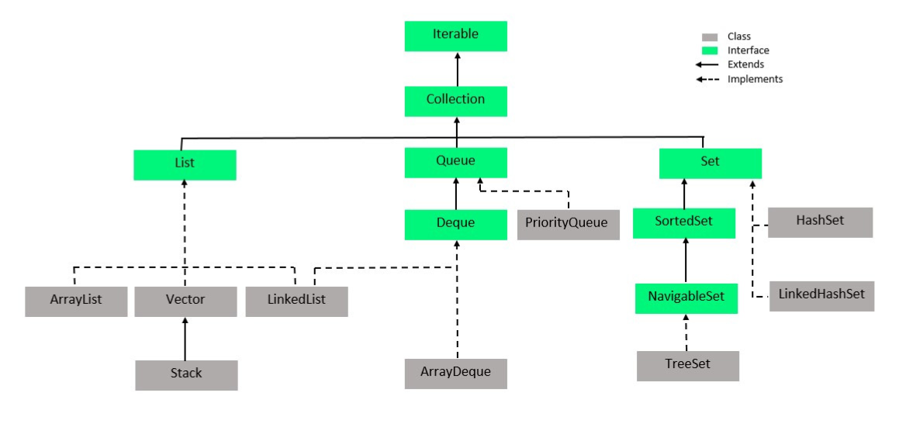

# Java

## Basics

- object reference is int32(32-bit JVM) or long64(64-bit system)

## 1. Collection<E> (interface)

- **Key methods**:
    - `add(E e)`
    - `remove(Object o)`
    - `contains(Object o)`
    - `size()`
    - `clear()`
    - `iterator()`

### Sequenced Collection

- `SequencedCollection<E> reversed()`
- `void addFirst(E e)`
- `void addLast(E e)`
- `E getFirst()` can throw `NoSuchElementException`
- `E getLast()` can throw `NoSuchElementException`
- `E removeFirst()` can throw `NoSuchElementException`
- `E removeLast()` can throw `NoSuchElementException`

### List<E> (ordered, allows duplicates)
- Implementations:
    - `ArrayList` 
      - grow on demand x1.5 
      - initial cap=10 but lazily allocates in first `add`(for custom cap allocates instantly).
      - doesn't trim automatically, use list.trimToSize()
    - `LinkedList` implements [Deque](#dequee-double-ended-queue)
    - `Vector` (old, slower than ArrayList because of synch, increases x2)
    - `Stack` (extends Vector, so better to use ArrayDeque)
- **Key methods** (in addition to Collection):
    - `get(int index)`
    - `set(int index, E element)`
    - `add(int index, E element)`
    - `remove(int index)`
    - `indexOf(Object o)`
    - `subList(int fromIndexInc, int toIndexExc)`

### Set<E> (no duplicates)
- Implementations:
    - `HashSet` use HashMap with constant value 
    - `LinkedHashSet extends HashSet<E> implements SequencedSet<E>` uses LinkedHashMap
    - `TreeSet`
- **Key methods**: Same as `Collection`, but no positional access

### SortedSet<E> → NavigableSet<E> (ordered set)
- Implementation:
    - `TreeSet`
- **Key methods**:
    - `first()`, `last()`
    - `headSet(E toElement)`, `tailSet(E fromElement)`
    - `subSet(E from, E to)`
    - `lower(E e)`, `higher(E e)`
    - `ceiling(E e)`, `floor(E e)`
    - `pollFirst()`, `pollLast()`

### Queue<E> (FIFO)
- Implementations:
    - `LinkedList`, `PriorityQueue`, `ArrayDeque`
- **Key methods**:
    - `offer(E e)`
    - `poll()`
    - `peek()`

### Deque<E> (double-ended queue)
- Implementations:
    - `ArrayDeque`, `LinkedList`
- **Key methods**:
    - `addFirst(E e)`, `addLast(E e)`
    - `removeFirst()`, `removeLast()` 
    - `peekFirst()`, `peekLast()` returns `null` instead of Exception comparing to `getFirst()`
    - `offerFirst(E e)`, `offerLast(E e)` works as `addFirst()` but returns `boolean` instead of Exception
    - `pollFirst()`, `pollLast()` get and remove or null

---

## 2. Map<K, V> (not part of Collection)
- Implementations:
    - `SequencedMap` interface, `reversed()`, `firstEntry()`, `pollFirstEntry()`, `putFirst(K k, V v)`, `sequencedKeySet()` 
    - `HashMap`
    - `LinkedHashMap` extends HashMap, each entry has link to prev and next entry.
    - `TreeMap`
    - `Hashtable` 
    - `ConcurrentHashMap`

### LinkedHashMap vs TreeMap

| Feature                          | LinkedHashMap                                         | TreeMap                                               |
|----------------------------------|--------------------------------------------------------|--------------------------------------------------------|
| **Ordering**                     | Insertion order (or access order if enabled)           | Sorted by keys (natural or via Comparator)             |
| **Underlying structure**         | Hash table + Doubly linked list                        | Red-black tree                                         |
| **Time complexity (get/put)**    | O(1) average case                                      | O(log n)                                               |
| **Key requirements**             | `equals()` and `hashCode()`                           | `Comparable` or `Comparator`                          |
| **Null keys**                    | ✅ Allows one `null` key                                | ❌ Not allowed                                          |
| **Iteration order**              | Insertion or access order                              | Sorted key order                                       |
| **Navigation methods**           | ❌ Not supported                                        | ✅ `firstKey()`, `lastKey()`, `subMap()`, etc.         |
| **LRU cache support**            | ✅ Yes (`accessOrder = true`)                           | ❌ No                                                  |
| **Range queries**                | ❌ Not supported                                        | ✅ Fully supported                                     |
| **Performance for large data**   | Faster random access, less overhead                    | Better for sorted/range-based access                  |
| **Thread safety**                | ❌ Not thread-safe                                      | ❌ Not thread-safe                                     |

### SortedMap<K, V> → NavigableMap<K, V>
- Implementation:
    - `TreeMap`
- **Key methods** (in addition to Map):
    - `firstKey()`, `lastKey()`
    - `subMap(K from, K to)`
    - `headMap(K toKey)`, `tailMap(K fromKey)`
    - `lowerEntry(K key)`, `higherEntry(K key)`
    - `floorEntry(K key)`, `ceilingEntry(K key)`
    - `pollFirstEntry()`, `pollLastEntry()`

---

## 3. Special Collections (Selected)
- `EnumSet` – efficient enum-based Set
- `EnumMap` – efficient enum-based Map
- `WeakHashMap` – keys are garbage-collectible
- `IdentityHashMap` – uses reference equality (==)
- `ConcurrentHashMap` – thread-safe map
- `CopyOnWriteArrayList`, `CopyOnWriteArraySet` – thread-safe snapshot collections

---

## Generics

- `List<? super Integer> list` - add `Integer`, read `Object`
- `List<?> list` - read only
- type erasure in runtime

### Variance Comparison: Java Arrays, Java Generics, Kotlin

**Covariant** = List<? extends Animal> = List<Dog> → safe **read**, can't write   
**Contravariant** = List<? super Dog> → safe **write**, read returns Object   
**Invariant** = List<String> != List<Object> — different types

| Structure            | Covariant (allows subtype)? | Contravariant? | Notes                                                                 |
|----------------------|-----------------------------|----------------|-----------------------------------------------------------------------|
| `Java arrays (T[])`  | ✅ Yes                      | ❌ No           | **Unsafe!** Arrays are covariant but not type-safe at runtime         |
| `List<T>` (Java)     | ❌ No                       | ❌ No           | Invariant — `List<Object>` ≠ `List<String>`                          |
| `List<? extends T>`  | ✅ Yes (read-only)          | ❌ No           | Covariant — can read, but can't safely add                           |
| `List<? super T>`    | ❌ No                       | ✅ Yes (write)  | Contravariant — can add `T`, but can't read as `T`                   |
| `Kotlin: Array<T>`   | ❌ No                       | ❌ No           | Invariant, like `List<T>` in Java                                     |
| `Kotlin: List<out T>`| ✅ Yes                      | ❌ No           | Covariant (like `? extends`), read-only                              |
| `Kotlin: List<in T>` | ❌ No                       | ✅ Yes          | Contravariant (like `? super`), usually for consumers                |

## Binary operations

| Operator Symbol | Name                    | Description                                      | Precedence | Associativity  |
|-----------------|-------------------------|--------------------------------------------------|------------|----------------|
| *               | Multiplication          | Multiplies two numbers                          | High       | Left-to-right  |
| /               | Division                | Divides left operand by right                   | High       | Left-to-right  |
| %               | Modulus (Remainder)     | Remainder of division                           | High       | Left-to-right  |
| +               | Addition                | Adds two values                                 | Medium     | Left-to-right  |
| -               | Subtraction             | Subtracts right operand from left               | Medium     | Left-to-right  |
| <<              | Left Shift              | Shifts bits left (fills with zeros)             | Low        | Left-to-right  |
| >>              | Signed Right Shift      | Shifts bits right (preserves sign bit)          | Low        | Left-to-right  |
| >>>             | Unsigned Right Shift    | Shifts bits right (fills with zeros)            | Low        | Left-to-right  |
| &               | Bitwise AND             | Performs bitwise AND                            | Lower      | Left-to-right  |
| ^               | Bitwise XOR             | Performs bitwise exclusive OR                   | Lower      | Left-to-right  |
| \|              | Bitwise OR              | Performs bitwise inclusive OR                   | Lower      | Left-to-right  |
| ==              | Equal to                | Checks if values are equal                      | Lower      | Left-to-right  |
| !=              | Not equal to            | Checks if values are not equal                  | Lower      | Left-to-right  |
| <               | Less than               | Checks if left is less than right               | Lower      | Left-to-right  |
| <=              | Less than or equal to   | Checks if left is less than or equal to right  | Lower      | Left-to-right  |
| >               | Greater than            | Checks if left is greater than right            | Lower      | Left-to-right  |
| >=              | Greater than or equal to| Checks if left is greater than or equal         | Lower      | Left-to-right  |
| &&              | Logical AND             | True if both operands are true                  | Very Low   | Left-to-right  |
| \|\|            | Logical OR              | True if at least one operand is true            | Very Low   | Left-to-right  |
| =               | Assignment              | Assigns right to left                           | Lowest     | Right-to-left  |
| +=, -=, etc.    | Compound Assignment     | Shorthand for operation and assignment          | Lowest     | Right-to-left  |

